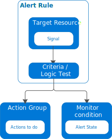

# Analyze Resource Utilization and Consumption

Training materials for the AZ-103 certification exam.

## Links

[Azure Monitor Overview](https://docs.microsoft.com/en-us/azure/azure-monitor/overview)

>Azure Monitor maximizes the availability and performance of your applications by delivering a comprehensive solution for collecting, analyzing, and acting on telemetry from your cloud and on-premises environments. It helps you understand how your applications are performing and proactively identifies issues affecting them and the resources they depend on.

[Sources of Monitoring Data for Azure Monitor](https://docs.microsoft.com/en-us/azure/azure-monitor/platform/data-sources)

>Azure Monitor is based on a common monitoring data platform that includes Logs and Metrics. Collecting data into this platform allows data from multiple resources to be analyzed together using a common set of tools in Azure Monitor.

[Azure Monitor Data Platform](https://docs.microsoft.com/en-us/azure/azure-monitor/platform/data-platform)

>Azure Monitor collects and aggregates data from a variety of sources into a common data platform where it can be used for analysis, visualization, and alerting. It provides a consistent experience on top of data from multiple sources, which gives you deep insights across all your monitored resources and even with data from other services that store their data in Azure Monitor

[Overview of Alerts in Microsoft Azure](https://docs.microsoft.com/en-us/azure/azure-monitor/platform/alerts-overview)

>Alerts proactively notify you when important conditions are found in your monitoring data. They allow you to identify and address issues before the users of your system notice them.

[Create and manage action groups](https://docs.microsoft.com/en-us/azure/azure-monitor/platform/action-groups)

>An action group is a collection of notification preferences defined by the owner of an Azure subscription. Azure Monitor and Service Health alerts use action groups to notify users that an alert has been triggered.

[Metrics in Azure Monitor](https://docs.microsoft.com/en-us/azure/azure-monitor/platform/data-platform-metrics)

>Metrics in Azure Monitor are lightweight and capable of supporting near real-time scenarios making them particularly useful for alerting and fast detection of issues.

## Introduction

What is Azure Monitor?

- Metrics
- Action Groups
- Monitoring Spend
- Unified Dashboard
- Log Search
- Log Analytics

Two fundamental types of data stores

- Metrics
  - Numerical values describing an aspect of a system at a particular point in time
  - Lightweight and capable of supporting near real-time scenarios
- Logs
  - Different types of data organized into records with different sets of properties for each type
  - Telemetry, such as events and traces, are stored as logs in addition to performance data

Six Azure Monitor services

- Metrics
- Unified Alerts
- Monitoring Spend
- Creating Dashboard
- Log Analytics
- Viewing Alerts in Log Analytics

## Skills

### Configure Diagnostic Settings on Resources

### Create Baseline for Resources

### Create and Rest Alerts

#### What Are Alerts

Proactively notify you when important conditions are found in you monitoring data.  Allow you to identify and address issues before users notice.

#### Flow of Alerts

Alert rules are separated from alerts and the actions that are taken when an alert fires.

#### Alert Rules

The alert rule captures the target and criteria for alerting. The alert rule can be in an enabled or a disabled state. Alerts only fire when enabled.

The following are the key attributes of an alert rule.

- **Target Resource**
  - Defines the scope and signals available for alerting
  - A target can be any Azure resource (virtual machine, storage account, etc.)
- **Signal**
  - Emitted by the target resource and can be of several types (Metric, Activity log, Application Insights, and Log)
- **Criteria**
  - Combination of Signal and Logic applied on a target resource.  For example
    - Percentage CPU > 70%
    - Server Response time > 4ms
- **Logic**
  - User define log to verify that the signal is within expected range/values
- **Alert Name**
  - Specific name for the alert rule configured by the user
- **Alert Description**
  - Description for the alert rule configured by the user
- **Severity**
  - Severity of the alert once the criteria specified in the alert rule is met
  - Severity can range from 0 to 4
- **Action**
  - Specific action taken when the alert is fired

#### What You Can Alert On

There a variety of metrics and logs that can be alerted on.

- Metric Values
- Log Search Queries
- Activity Log Events
- Health of the Underlying Azure Platform
- Tests for Web Site Availability

#### Manage Alerts

The state of an alert is used to specify where it is in the resolution process.  When the criteria defined in the alert rule is met, an alert is create or fired with a status of _New_.  The status of an alert can be changed when it is acknowledged and when it is closed.  All state changes are stored in the history of the alert.

The following alert states are supported.

State | Description
--- | ---
New | The issue has just been detected and has not yet been reviewed
Acknowledged | An administrator has reviewed the alert and started working on it
Closed | The issue has been resolved

After an alert has been closed, it can be reopened by changing it to another state.

Alert state is different and independent of the monitor condition. Alert state is set by the user. Monitor condition is set by the system. When an alert fires, the alert's monitor condition is set to _fired_. When the underlying condition that caused the alert to fire clears, the monitor condition is set to _resolved_. The alert state isn't changed until the user changes it.

#### Creating Alerts

Alerts can be authored in a consistent manner regardless of the monitoring service or signal type. All fired alerts and related details are available in single page.

New alerts rules are created in three steps.

1. Pick the _target_ for the alert
1. Select the _signal_ from the available signals for the target
1. Specify the _logic_ to be applied to data from the signal

The simplified authoring process no longer requires knowing the monitoring source or signals that are supported before selecting an Azure resource. The list of available signals is automatically filtered based on the target resource that you select. Also based on that target, you are guided through defining the logic of the alert rule automatically.

### Analyze Alerts Across Subscription

### Analyze Metrics Across Subscription

#### What are metrics

- Numerical values that describe some aspect of a system at a particular point in time
- Lightweight and capable of supporting near real-time scenarios
- Useful for alerting because they can be sampled frequently

#### Metric Value Attributes

- Collection at one minute intervals unless specified otherwise in the metrics definition
- Uniquely identified by a metric name and a metric namespace that acts as a category
- Stored for 93 days unless copied to _Log Analytics_ for long term trending

#### Metric Value Properties

- The _Time_ the value was collected
- The _Type_ of measurement the value represents
- The _Resource_ with which the value is associated
- The _Value_ itself

Some metrics may have multiple dimensions (such as custom metrics).

#### Source of Metric Data

There are three fundamental sources of metrics collected by Azure Monitor.  All of these metrics are available in the metrics store where they can be evaluated together regardless of their source.

- **Platform Metrics**
  - Created by Azure resources and give visibility into their health and performance
  - Collected from Azure resources at one-minute frequency unless specified otherwise
- **Guest OS Metrics**
  - Collected from the guest operating system of a virtual machine
- **Application Metrics**
  - Created by Application Insights for monitored applications
  - Help detect performance issues and track trends in how applications are being used
- **Custom Metrics**
  - User defined metrics in addition to the standard metrics that are automatically available

#### Using Metrics Data

- **Analyze**
  - Use metrics explorer to analyze collected metrics on a chart and compare metrics from different resources
- **Visualize**
  - Pin a chart from metrics explorer to an Azure dashboard
  - Create a workbook to combine with multiple sets of data in an interactive report
- **Alert**
  - Configure a metric alert rule that sends a notification or takes automated action when the metric value crosses a threshold
- **Automate**
  - Use Autoscale to increase or decrease resources based on a metric value crossing a threshold
- **Export**
  - Route Metrics to Logs to analyze data in Azure Monitor Metrics together with data in Azure Monitor Logs
  - Stream Metrics to an Event Hub to route them to external systems
- **Retrieve**
  - Access metric values from a command line using PowerShell
  - Access metric values from custom application using REST
  - Access metric values from a command line using CLI
- **Archive**
  - Archive the performance or health history of resources for compliance, auditing, or offline reporting purposes

### Create Action Groups

An action group is a collection of notification preferences defined by the owner of an Azure subscription. Azure Monitor and Service Health alerts use action groups to notify users that an alert has been triggered.

There are three properties that define an action

- Name
  - A unique identifier within the action group
- Action Type
  - The action performed.
- Details
  - The corresponding details that vary by action type.

There are a variety of actions types available to action groups.

- Automation Runbook
- Push Notification
- Email
- Function App
- ITSM
- Logic App
- SMS
- Voice
- Webhook

### Monitor for Unused Resources

### Monitor Spend

There are two options available understand your Azure bill

#### Option 1: Compare your invoice with the detailed daily usage file

The detailed usage CSV file shows your charges by billing period and daily usage.  Usage charges are displayed at the meter level. The following terms mean the same thing in both the invoice and the detailed usage file.

Invoice (PDF) | Detailed Usage (CSV)
--- | ---
Billing Cycle | Billing Period
Name | Meter Category
Type | Meter Subcategory
Resource | Meter Name
Region | Meter Region
Consumed | Consumed Quantity
Included | Included Quantity
Billable | Overage Quantity

[Understand Your Azure Invoice](https://docs.microsoft.com/en-us/azure/billing/billing-understand-your-invoice)

[Understand Your Azure Detailed Usage](https://docs.microsoft.com/en-us/azure/billing/billing-understand-your-invoice)

#### Option 2: With cost management reports in the Azure portal

The Azure portal can also help verify charges. To get a quick overview of invoiced usage and charges, view the cost management charts.

[Monitor Cost Breakdown and Burn Rate](https://docs.microsoft.com/en-us/azure/billing/billing-getting-started#costs)

### Report on Spend

### Utilize Log Search Query Functions

### View Alerts in Log Analytics
